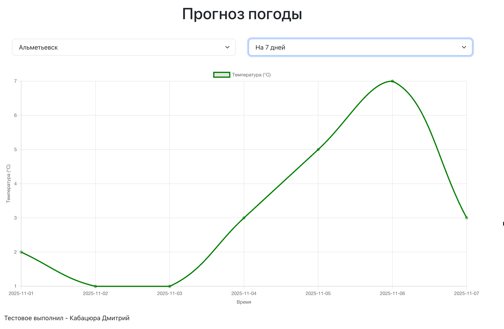
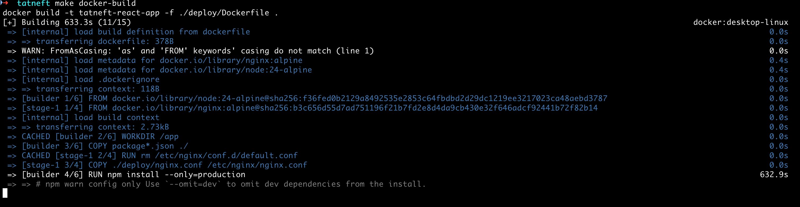

# Прогноз погоды для Татнефть



Все сборки для проекта расположены в файле Makefile.

Для запуска локально, попробуйте команду:

```
make dev
```

Так как нахожусь в Крыму, есть проблемы с установкой зависимостями и к доступу документациям (ip видимо блокируются)

Поэтому не смог выложить проект на сервер:

Пример, что зависимости не устанавливаются с первого раза.


Адрес хоста для проекта (пока нет возможности загрузить): 77.222.40.198
